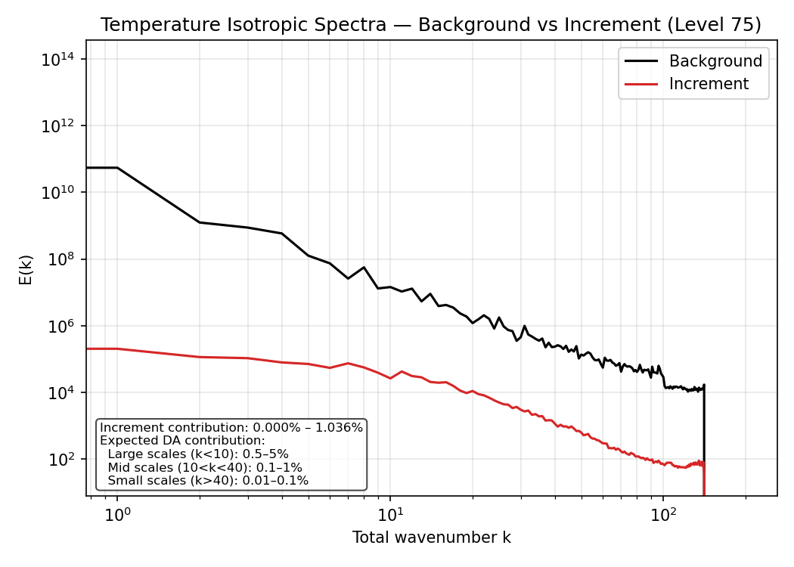
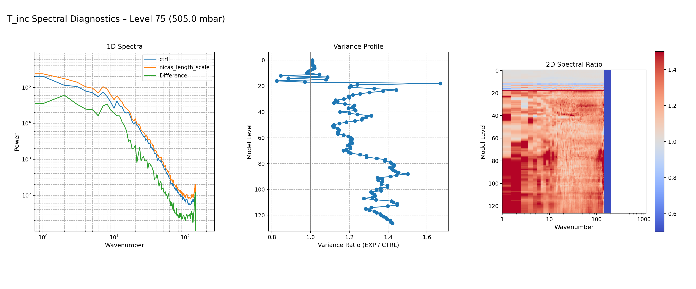
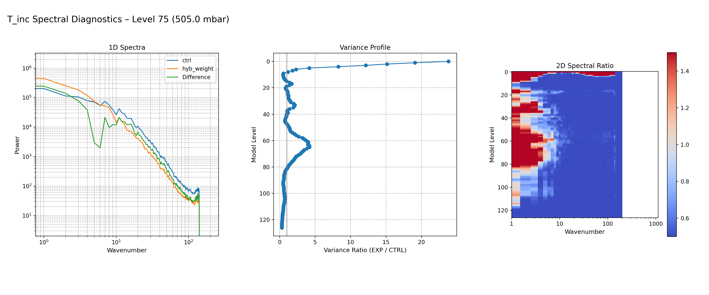

.. _diagnostics_overview:

Diagnostics Overview
====================

This diagnostics package is part of the CADRE EPIC FV3-JEDI training
workflow and is used in the 2026 CADRE Data Assimilation Workshop
(https://epic.noaa.gov/cadre-epic-data-assimilation-training/). The
tools support the hands-on sessions for the FV3-JEDI hybrid 3D-Var
canned case (C96/C48), providing participants with a unified framework
for analyzing background fields, increments, observation departures,
spectral characteristics, and chi-square consistency. The same
diagnostics are used throughout the CADRE Year-2 experiments, including
the ATMS, GNSSRO, ASCAT, and surface pressure components of the
FV3-JEDI system.

The diagnostics toolkit provides a unified set of tools for analyzing
background fields, increments, observation departures, and spectral
properties of the data assimilation system. In addition to the standard
diagnostic capabilities—increment maps, zonal means, observation
histograms, satellite scan‑position bias checks, and latitude‑binned
statistics—the toolkit includes two advanced diagnostic components:

1. **Power Spectral Analysis**  
   Used to quantify how variance is distributed across spatial scales
   and how experiments (e.g., NICAS length‑scale changes) modify the
   spectral characteristics of increments and background fields.

2. **Extended RMS Statistics**  
   Channel‑wise diagnostics of O–B and O–A bias, RMS, normalized RMS,
   bias‑corrected RMS, and analysis improvement metrics. These extended
   statistics provide a detailed view of observation‑space performance
   beyond simple mean and RMS values.

In addition, the toolkit supports a **chi‑square consistency check**
through automated parsing of JEDI log files. This diagnostic evaluates
whether the ratio :math:`\mathrm{Jo}/p` approaches unity, indicating
consistency between observation errors, background errors, and the
resulting analysis increments.

The following sections describe the mathematical formulation of these
diagnostics and provide example figures illustrating their use.

Spectral Diagnostics
====================

Overview
--------

Spectral diagnostics quantify how variance is distributed across spatial
scales. The UFS DA diagnostics compute *isotropic 1‑D spectra* derived
from a full *2‑D horizontal Fourier transform*. This reveals how the
background (BKG), increments (INC), and experiment differences modify
energy across scales.

2‑D Fourier Transform
---------------------

For a horizontal field :math:`f(x, y)` on an :math:`N_x \times N_y` grid,
the 2‑D Discrete Fourier Transform is

.. math::

   F(k_x, k_y) =
   \sum_{x=0}^{N_x-1}
   \sum_{y=0}^{N_y-1}
   f(x, y)\,
   e^{-i 2\pi \left( \frac{k_x x}{N_x} + \frac{k_y y}{N_y} \right)}

Each pair :math:`(k_x, k_y)` corresponds to one *grid‑scale sinusoidal
wave* with a specific wavelength and direction.

Power Spectrum
--------------

The 2‑D power spectrum is

.. math::

   P(k_x, k_y) = |F(k_x, k_y)|^2

This represents the energy contribution of each grid‑scale wave.

Isotropic Spectrum
------------------

The 2‑D spectrum is radially averaged into bins of total wavenumber

.. math::

   K = \sqrt{k_x^2 + k_y^2}

to produce a 1‑D isotropic spectrum :math:`P(K)`. This gives the
distribution of variance across spatial scales.

Parseval Consistency
--------------------

The total variance in physical space equals the total power in spectral
space:

.. math::

   \sum_{x,y} f(x,y)^2
   =
   \frac{1}{N_x N_y}
   \sum_{k_x,k_y} |F(k_x, k_y)|^2

This ensures that the isotropic spectrum is a true variance
decomposition by scale.

Background vs Increment Spectra (Control Experiment)
----------------------------------------------------

The background (BKG) spectrum typically follows a smooth power‑law decay,
reflecting the model’s natural distribution of variance. The increment
(INC) spectrum is much smaller and shows how the analysis updates
redistribute variance across scales.

A *healthy* DA system produces increments that:

- contain most of their energy at large scales  
- have very little high‑wavenumber energy  
- do not inject noise at small scales  

In the control experiment, the increment spectrum exhibits a *large‑scale
plateau*. This is expected: the largest scales are dominated by broad,
domain‑wide adjustments, and the isotropic bins at the smallest
wavenumbers contain only a few modes, producing a flat appearance.

   Background and increment spectra for temperature at model level 75 in
   the control experiment. The increment spectrum is smooth and confined
   to large scales. The plateau at the lowest wavenumbers reflects broad,
   domain‑scale adjustments and the small number of modes in the first
   isotropic bins.

Spectral Ratio (EXP vs CTRL)
----------------------------

The spectral ratio compares the scale‑dependent variance between two
experiments:

.. math::

   R(K) = \frac{P_{\mathrm{EXP}}(K)}{P_{\mathrm{CTRL}}(K)}

Interpretation:

- :math:`R(K) > 1` — EXP has **more energy in the grid‑scale waves** at scale :math:`K`
- :math:`R(K) < 1` — EXP has **less energy** at that scale

NICAS Length‑Scale Experiment
-----------------------------

Increasing the NICAS horizontal correlation length scale broadens the
static covariance’s spatial correlations. The static covariance itself is
unchanged in shape; only the length scale parameter increases. This
produces smoother increments and enhances variance at the largest
spatial scales (small K), while reducing variance at smaller scales.

   CTRL vs NICAS length‑scale increment spectra at model level 75.
   Increasing the NICAS horizontal correlation length scale boosts
   large‑scale variance and suppresses small‑scale variance, producing
   smoother increments.

Static Background Covariance Weight Experiment
----------------------------------------------

This experiment increases the weight of the climatology‑based static
background‑error covariance in the hybrid formulation. The static
covariance itself is unchanged; only its relative contribution to the
total hybrid covariance increases compared to the flow‑dependent
ensemble covariance.

Increasing the static weight enhances variance at the largest spatial
scales (small K) while suppressing variance at smaller scales. This
produces smoother increments dominated by broad, domain‑scale structure.

   CTRL vs increased static background‑covariance weight for temperature
   increments at level 75. The increased static weight boosts large‑scale
   variance and damps small‑scale variance, reflecting the dominance of
   smoother climatological static covariance.

Observation Statistics
======================

Formulation
-----------

Let :math:`y_i` be an observation, and let :math:`H(x_b)_i` and
:math:`H(x_a)_i` denote the background and analysis model equivalents.
Define the departures:

.. math::

   d_{b,i} = y_i - H(x_b)_i, \qquad
   d_{a,i} = y_i - H(x_a)_i.

Mean (Bias)
~~~~~~~~~~~

.. math::

   \mu(d) = \frac{1}{N} \sum_{i=1}^{N} d_i

**Meaning:** Measures systematic error. A reduction from O–B to O–A
indicates improved bias characteristics.

RMS (Root‑Mean‑Square Error)
~~~~~~~~~~~~~~~~~~~~~~~~~~~~

.. math::

   \mathrm{RMS}(d) = \sqrt{\frac{1}{N} \sum_{i=1}^{N} d_i^2}

**Meaning:** Measures total error magnitude (bias + random error).

RMS Difference (Analysis Improvement)
~~~~~~~~~~~~~~~~~~~~~~~~~~~~~~~~~~~~~

.. math::

   \Delta \mathrm{RMS} = \mathrm{RMS}(d_a) - \mathrm{RMS}(d_b)

or normalized:

.. math::

   \Delta \mathrm{RMS}_{\text{rel}} =
   \frac{\mathrm{RMS}(d_a) - \mathrm{RMS}(d_b)}{\mathrm{RMS}(d_b)}

**Meaning:** Negative values indicate analysis improvement.

Normalized RMS
~~~~~~~~~~~~~~

If observation error standard deviations :math:`\sigma_{o,i}` are available:

.. math::

   d_{n,i} = \frac{d_i}{\sigma_{o,i}}, \qquad
   \mathrm{RMS}_n = \sqrt{\frac{1}{N} \sum_{i=1}^{N} d_{n,i}^2}

**Meaning:**  
- :math:`\mathrm{RMS}_n \approx 1` → observation errors well specified  
- :math:`\mathrm{RMS}_n \gg 1` → errors underestimated  
- :math:`\mathrm{RMS}_n \ll 1` → errors overestimated  

Bias‑Corrected RMS
~~~~~~~~~~~~~~~~~~

.. math::

   \mathrm{BC\text{-}RMS}(d) =
   \sqrt{\frac{1}{N} \sum_{i=1}^{N} (d_i - \mu(d))^2}

**Meaning:** Measures random error only (bias removed).

Extended ATMS Statistics
------------------------

.. figure:: _static/images/obs/atms_stats_extended.png
   :width: 90%
   :align: center
   :class: left-caption

   Extended ATMS observation‑space diagnostics showing O–B and O–A bias,
   RMS, normalized RMS, bias‑corrected RMS, and analysis improvement
   metrics. These statistics quantify systematic error, total error,
   random error, and the degree to which the analysis reduces
   observation‑space departures.

Chi‑Square Consistency Check
============================

The chi‑square consistency diagnostic evaluates whether the innovations
(OMB) are broadly compatible with the assumed observation‑error
variances. It provides a quick indication of whether the specified
observation‑error model is reasonable.

For each observation i, the innovation d_b is scaled by its assumed
observation‑error variance σ_{o,i}². The normalized innovation is

.. math::

   z_i = \frac{d_{b,i}}{\sigma_{o,i}}.

If the observation‑error model is reasonable, the average value of z_i²
should be close to one. This leads to the chi‑square consistency measure

.. math::

   \chi^2 = \frac{1}{N} \sum_{i=1}^{N}
            \frac{d_{b,i}^2}{\sigma_{o,i}^2}.

Interpretation
--------------

- χ² ≈ 1  
  → observation‑error variances are broadly consistent with the size of
    the innovations.

- χ² >> 1  
  → observation‑error variances are likely too small (innovations too
    large).

- χ² << 1  
  → observation‑error variances are likely too large (innovations too
    small).

Practical Computation in JEDI
-----------------------------

The toolkit computes this diagnostic by reading the JEDI log and using
the reported values of Jo and the number of assimilated observations p:

.. math::

   \chi^2 \approx \frac{J_o}{p}.

Here Jo/p is a practical, heuristic average of the normalized innovation
variance. It is not a formal statistical test, but it provides a quick
sense of whether the assumed observation‑error variances are in a
reasonable range.

Channel‑Wise Normalized RMS²
----------------------------

The `obs_diagnostic.py (ufsda-obs-diag)` script also computes a channel‑by‑channel normalized
RMS² value for instruments such as ATMS:

.. math::

   \mathrm{NRMS}^2_c = \frac{1}{N_c}
                       \sum_{i \in c}
                       \frac{d_{b,i}^2}{\sigma_{o,i}^2},

where N_c is the number of assimilated observations in channel c.

This quantity is directly comparable to Jo/p, but computed separately for
each channel rather than over all observations. Channel‑wise NRMS² helps
identify channels with mis-specified observation errors or
representativeness issues.

Reference
---------

- Talagrand, O. (2003). Evaluation of probabilistic prediction systems.
  ECMWF Workshop on Diagnostics for Data Assimilation Systems.

Weather Events Diagnostics
--------------------------

The weather‑events module provides global synoptic‑scale diagnostics
derived from FV3 ATM background fields. It identifies dynamically coherent
features such as:

* 500 hPa cyclone centers (vorticity‑based)
* 250 hPa jet streaks (ridge detection)
* 850 hPa baroclinic zones (temperature‑gradient magnitude)

These diagnostics complement increment‑based tools by providing a
large‑scale flow context for DA experiments.

See :doc:`usage_weather_events` for usage examples.
