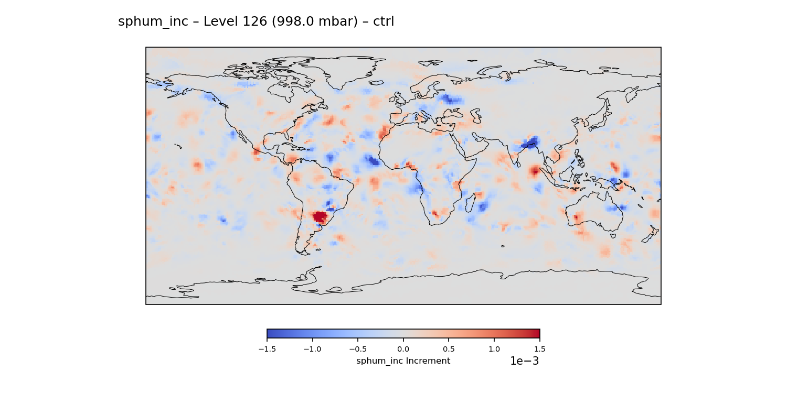
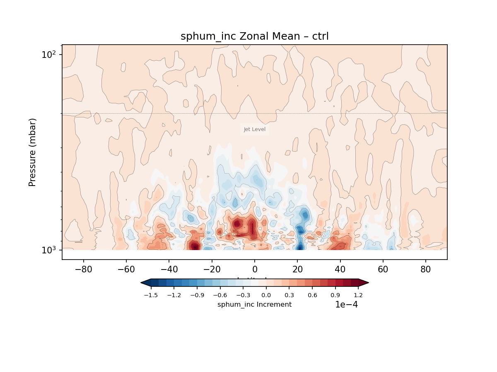

Using Increment Diagnostics
===========================

The increment diagnostics subsystem generates FV3 6‑tile maps, stitched
global maps, and zonal‑mean summaries for analysis increments. These
diagnostics provide spatial insight into how the analysis modifies the
background state. They are complementary to observation‑space and
spectral diagnostics but do not compute spectra.

Running the CLI Tool
--------------------

The main driver for increment diagnostics is:

.. code-block:: bash

    ufsda-inc-maps --yaml /path/to/increment_maps.yaml

This tool loads FV3 tiles, constructs global stitched fields, and
computes zonal‑mean cross sections for each variable and level specified
in the YAML file.

Example Figures
---------------

Global Increment Map
~~~~~~~~~~~~~~~~~~~~

   Example stitched global increment map for specific humidity at
   model level 126. Positive increments indicate moistening applied
   by the analysis, while negative increments indicate drying.

Zonal‑Mean Increment Cross‑Section
~~~~~~~~~~~~~~~~~~~~~~~~~~~~~~~~~~

   Full‑vertical zonal‑mean increment cross‑section for specific
   humidity. This view highlights the vertical structure and
   latitudinal distribution of the analysis increments.

YAML Configuration
------------------

A minimal YAML configuration for increment maps:

.. code-block:: yaml

    experiments:
      - name: EXP
        prefix: /path/to/exp/ufsda.t00z.atminc.cubed_sphere_grid.tile

    grid:
      prefix: /path/to/grid/C96_grid.tile

    output_dir: increment_maps/

    vars:
      - u_inc
      - v_inc
      - T_inc
      - sphum_inc

    levels:
      - 126
      - 75

Amplification Options
---------------------

Increment fields are often small in magnitude, especially for humidity
and wind components. To improve visual interpretability, the increment
diagnostics support optional amplification of plotted fields.

Amplification is controlled through the ``amplify`` section of the YAML
configuration:

.. code-block:: yaml

    amplify:
      enabled: true
      factor: 2.0
      apply_to_diff: false

Options
~~~~~~~

``enabled``  
    Enables or disables amplification. When ``true``, all CTRL and EXP
    fields are multiplied by the specified factor before plotting.

``factor``  
    Scalar multiplier applied to increment values. Typical values range
    from 1.5 to 5.0 depending on variable magnitude.

``apply_to_diff``  
    Controls whether the DIFF field (``EXP − CTRL``) is also amplified.
    By default this is ``false`` to preserve the true magnitude of
    experiment differences. When set to ``true``, the DIFF field is
    amplified using the same factor.

Behavior Summary
~~~~~~~~~~~~~~~~

* CTRL fields → amplified when ``enabled: true``  
* EXP fields → amplified when ``enabled: true``  
* DIFF fields → amplified **only** when ``apply_to_diff: true``  
* Zonal‑mean plots follow the same rules

Example
~~~~~~~

To amplify all fields including DIFF by a factor of 2:

.. code-block:: yaml

    amplify:
      enabled: true
      factor: 2.0
      apply_to_diff: true

Outputs
-------

- ``global_maps/`` — stitched global maps for each variable and level  
- ``zonal_means/`` — zonal‑mean cross sections (latitude vs level)  

These outputs provide complementary spatial perspectives on the
structure and scale of analysis increments.
